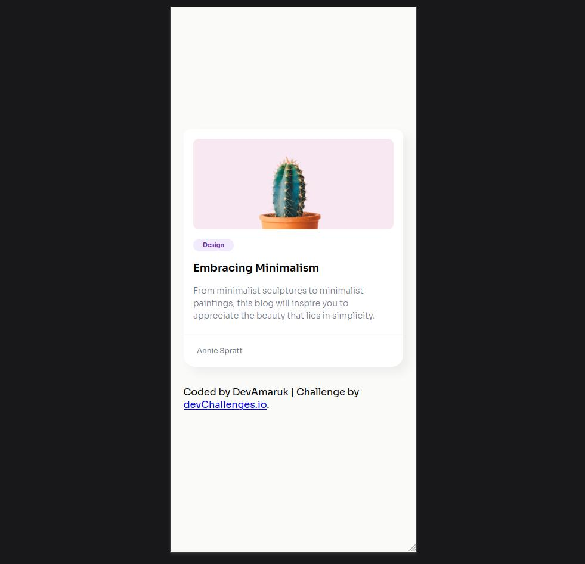
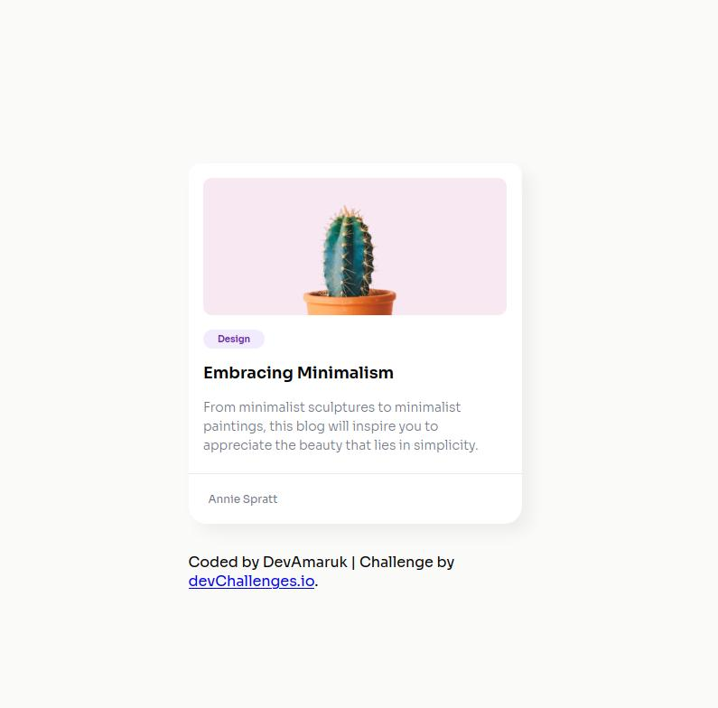
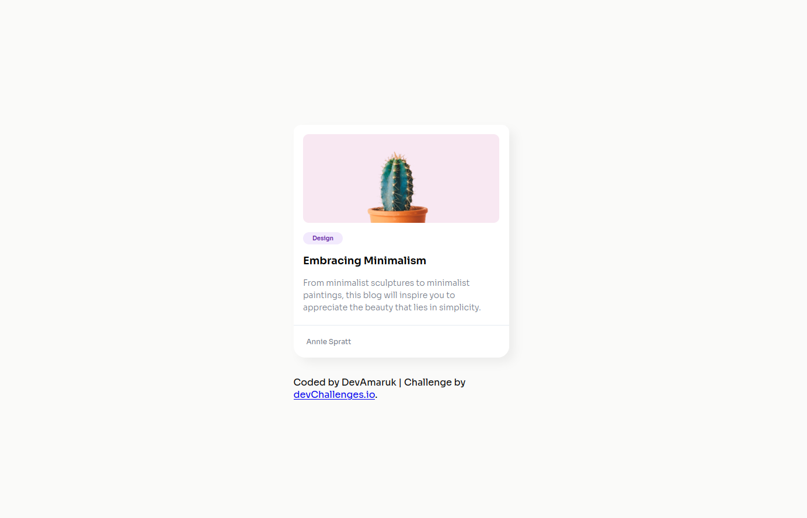

<!-- Please update value in the {}  -->

<h1 align="center">Blog Minimal Card | devChallenges</h1>

   Solution for a challenge <a href="https://devchallenges.io/challenge/minimal-blog-card" target="_blank">Minimal Blog Card</a> from <a href="http://devchallenges.io" target="_blank">devChallenges.io</a>.

  <h3>
    <a href="https://devamaruk.github.io/Blog-Minimal-Card/">
      Demo
    </a>
     | 
    <a href="https://github.com/DevAmaruk/Blog-Minimal-Card">
      Solution
    </a>
     | 
    <a href="https://devchallenges.io/challenge/minimal-blog-card">
      Challenge
    </a>
  </h3>

<!-- TABLE OF CONTENTS -->

## Table of Contents

- [Overview](#overview)
  - [What I learned](#what-i-learned)
  - [Useful resources](#useful-resources)
- [Built with](#built-with)
- [Features](#features)
- [Contact](#contact)
- [Acknowledgements](#acknowledgements)

<!-- OVERVIEW -->

## Overview

### Screenshots

Mobile

Tablet

Desktop

### What I learned

I learned how to give a keyframe animation on the card when a mouse is hovering.

### Built with

<!-- This section should list any major frameworks that you built your project using. Here are a few examples.-->

- Semantic HTML5 markup
- CSS custom properties
- Flexbox

## Author

- Github - [Devamaruk](https://github.com/DevAmaruk)
- Linkedin - [Jonathan Guthauser](https://www.linkedin.com/in/jguthauser/)
